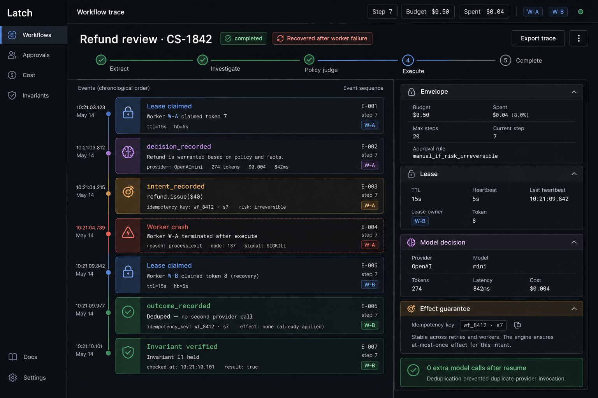
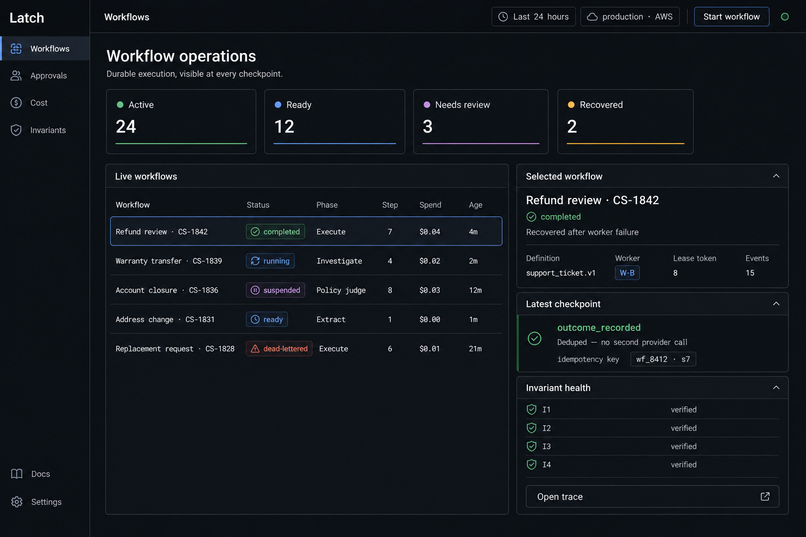
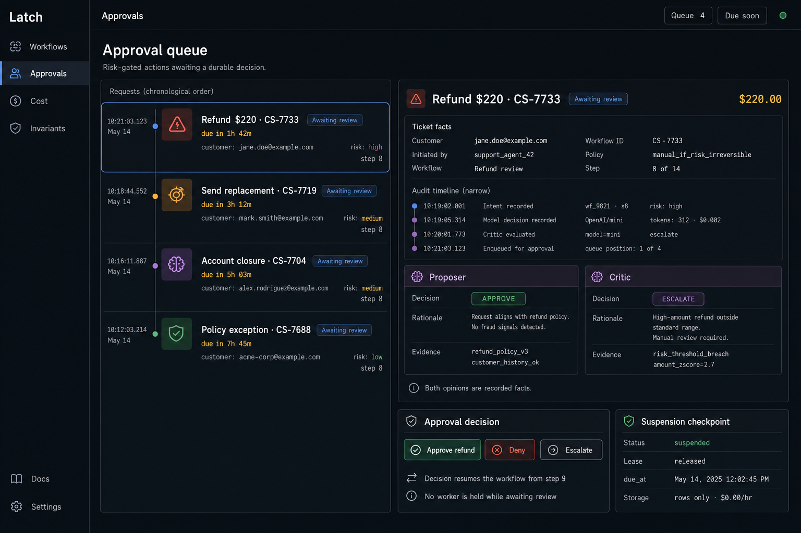
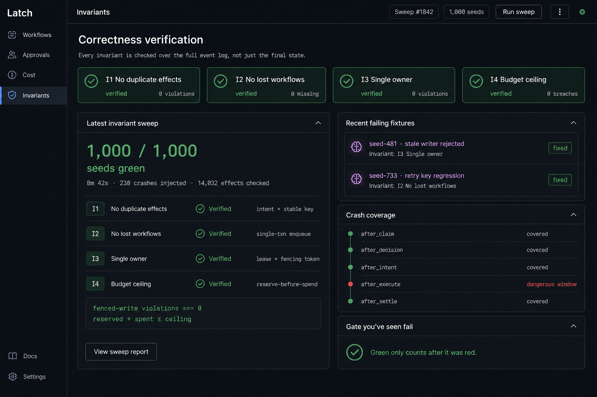

# Latch

[](https://github.com/Sashreek007/Latch/actions/workflows/ci.yml)


[](LICENSE)


**A durable execution engine for AI agent workflows.** Temporal-shaped crash safety, but the path
through the workflow is chosen by a model at runtime. Every model decision is recorded as a durable
fact and resumed *from* — never replayed.

---

> [!WARNING]
> **This is an early build, and the repository is public well before it is finished.**
>
> **Working today (M0–M1):** the append-only event log with same-transaction projection, an HTTP API
> that starts and reads workflows, a polling worker, a typed SDK client, CDK stacks that synthesise
> in CI, and GitHub OIDC deploys with no long-lived credentials.
>
> **Not built yet:** leases and fencing, the invariant harness, effectively-once side effects, the
> agent step, budget envelopes, the proposer/critic gate, human approvals, the dashboard, and the AWS
> deployment itself. **The dashboard images below are design prototypes, not screenshots** — that UI
> does not exist yet.
>
> No performance or correctness numbers are published here, because none have been measured. The
> plan for producing them is in [`docs/MVP.html`](docs/MVP.html); the design they come from is in
> [`docs/DESIGN.html`](docs/DESIGN.html).

---

## What is Latch?

Workflow engines like Temporal survive crashes by **replaying** your code and feeding back recorded
results. That demands your orchestration stay deterministic forever, which an LLM in the loop is
not.

Latch inverts it. A workflow is a sequence of phases; some are plain code, some are agent steps
where a model decides what to do next within a scoped set of tools. Every decision the model makes —
the model id, the prompt hash, the tokens, the dollar cost, the structured output — is appended to
an event log inside the same transaction that advances the workflow's state. Recovery reads those
facts forward from the last checkpoint. **Nothing is re-executed, and the model is never re-asked.**

That single choice buys three things a replay engine struggles with: mid-run deploys are trivially
safe because no old code is replayed, the log *is* the audit trail (who decided what, at what cost,
on what evidence), and non-determinism stops being a constraint.

Around that sits the part a generic workflow engine has no analog for — a control plane built for
agents. Dollar budgets enforced before a call is made rather than after, tool scoping the model
cannot talk its way out of, risk classes that route irreversible actions to a human, and a second
model that reviews before anything irreversible runs.

Latch is infrastructure, not a chatbot, and it does not claim exactly-once against third-party APIs —
see [Known gaps](#known-gaps).

---

## How does it work?


**One Postgres holds everything** — the queue, the event log, the projected state, intents, effects,
approvals and the dead-letter queue. Not for simplicity, but because the correctness argument
requires it: a workflow's queue entry and its state transition have to commit *together*, and no
transaction spans two systems.

| Mechanism | How |
| --- | --- |
| **Queue** | A ready row *is* the queue entry. Claim with `SELECT … FOR UPDATE SKIP LOCKED` |
| **Leases** | Claim → one step → checkpoint → release. Heartbeat 5 s, TTL 15 s |
| **Fencing** | Every write carries a monotonic `lease_token`; a stalled worker that wakes after takeover matches zero rows |
| **Side effects** | An intent with a step-scoped idempotency key is written *before* the effect; dedupe is a `PRIMARY KEY` on an effects table |
| **Budgets** | Worst-case cost is reserved in the claim transaction, so a call that would breach the ceiling never happens |
| **Guardrails** | Tool scoping is enforced in dispatch, not in the prompt. The idempotency key is a *required* parameter, so a tool without one cannot exist |

### The four invariants

The headline is not latency or throughput — it is correctness under failure, checked as pure
functions over the finished event log across thousands of seeded crash schedules.

| | Invariant |
| --- | --- |
| **I1** | Every idempotency key executes exactly once |
| **I2** | Every started workflow reaches a terminal or suspended state — none lost |
| **I3** | No two workers ever own the same workflow |
| **I4** | Spend never exceeds the ceiling, checked at every log prefix |

A gate is only trusted once it has been **seen red**: break the mechanism deliberately, watch a
specific seed fail, revert.

---

## Where it runs

Two first-class environments. Local Docker Compose is where development and verification happen —
the invariant sweep runs there, because it is the same engine code issuing the same SQL. AWS is
production.


> The diagram is the **target** architecture. Today only the CDK stacks and the OIDC deploy role
> exist — see the status note above. Deploying to Fargate and RDS is the next chunk.

The governing rule is *managed services everywhere except the correctness path*. Step Functions, SQS
as the workflow queue, DynamoDB, Lambda workers, EventBridge Scheduler and EKS were each evaluated
and rejected for a specific reason tied to an invariant or a cost — the reasoning is in
[`docs/MVP.html`](docs/MVP.html).

---

## The dashboard

> [!NOTE]
> **These are design prototypes, not screenshots.** The dashboard has not been built. They are here
> to show the intended shape; the real thing replaces them when it exists.

|  |  |
| --- | --- |
| <br>**Trace** — lease claimed, decision recorded, intent written, the worker dies, a *different* worker reclaims the lease, the retry dedupes. The engine's whole argument, in one screen. | <br>**Operations** — live workflows with phase, step, spend and age, alongside checkpoint activity. |
| <br>**Approvals** — a risk-gated action waiting on a human, with the proposer's and the critic's opinions both recorded as facts. | <br>**Invariants** — the sweep with its denominators: crashes injected, effects checked, and the fixtures that once failed. |

---

## Repository layout

```
packages/
  engine/     the core — event vocabulary, fold to projection, transactional append, log reader
  api/        Fastify: start a workflow, read its status and log
  worker/     the polling loop, step runner, error isolation
  sdk/        typed client for defining and starting workflows
  demos/      ticket-v0 — the support-ticket workflow that thickens as the engine grows
infra/        AWS CDK — network, data, services and GitHub OIDC stacks
migrations/   node-pg-migrate SQL
docs/
  DESIGN.html the design document — decisions D1–D25, deep dives, capacity and scaling tiers
  MVP.html    the build plan — per-chunk deliverables, verify gates, published-numbers tiers
```

## Quickstart

You need Docker and Node 24.

```bash
pnpm install
docker compose up -d
pnpm migrate
pnpm test
```

Start the API and a worker in separate shells:

```bash
pnpm --filter @latch/api dev
pnpm --filter @latch/worker dev
```

Then start a workflow:

```bash
curl -X POST localhost:3000/workflows \
  -H 'content-type: application/json' \
  -d '{
    "tenantId": "acme",
    "defName": "ticket",
    "input": { "subject": "refund please", "customerEmail": "a@b.com" }
  }'
```

`GET /workflows/:id` returns the projected state; the full event log is in the `workflow_events`
table, and re-folding it must equal the projection — that assertion is already a test.

## Working on it

```bash
pnpm lint
pnpm test
cd infra && pnpm cdk synth
```

CI runs two jobs on every push: `check` (lint and tests) and `infra` (authenticates to AWS via OIDC
and synthesises the CDK app). No AWS credentials are stored anywhere in the repository.

## Roadmap

Sixteen chunks, M0–M15. Two are done; the remaining nine of the MVP are ordered so the project is
shippable partway through rather than only at the end.

| | Chunk | State |
| --- | --- | --- |
| M0 | Scaffold — monorepo, Compose, migrations, CI, CDK skeleton, OIDC | **done** |
| M1 | Walking skeleton + event log | **done** |
| M2 | Deploy the skeleton — ECS Fargate, RDS, Secrets Manager, IAM | next |
| M3 | Queue, leases, fencing — the kill demos | |
| M4 | Harness v1 — seeded crash schedules, I2 + I3 | |
| M5 | Intents + effects — I1 | |
| M6 | Agent step + envelope + tiers — I4, OpenAI and Bedrock | |
| M7 | Tool scoping, risk classes, proposer/critic | |
| M14 | Dashboard — the trace view | |
| M15 | Ship — the 1,000-seed sweep and the numbers | |
| M8 | Human-in-the-loop + dead letters | |

Deferred to post-MVP: MCP and LangChain tool adapters, cross-workflow case memory, the labeled
scenario suite, queue-depth autoscaling, the production edge, and the cost and list pages.

## Known gaps

Stated rather than left to be discovered:

- **Most of the engine is not built.** See the status note at the top. The design is complete; the
  code is at chunk two of sixteen.
- **No numbers are published**, because none have been measured. Every figure this project intends
  to claim comes from the harness, which is chunk M4.
- **"Exactly-once" is not claimed.** For tools Latch owns, the effects table makes dedupe airtight.
  For third-party APIs the idempotency key is passed through, and the guarantee is exactly as good
  as that provider's support — stated, not hidden.
- **Seeded schedules are not full deterministic simulation.** They reproduce failures caused by
  injected faults at named points; they do not control OS scheduling or hardware races.
- **pgvector is enabled but unused** — it was provisioned for cross-workflow case memory, which is
  now deferred.

## License

MIT — see [LICENSE](LICENSE).
